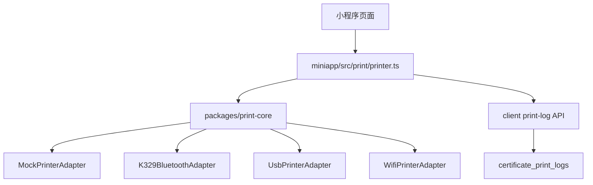

# 打印模块技术说明

## 模块目标

打印模块需要支持：

- 多品牌打印机；
- 多连接方式；
- 多标签模板；
- 模拟打印和真实打印并存；
- 打印状态反馈；
- 打印日志追溯。

## 分层设计

## 页面职责

页面只负责：

- 展示打印机状态；
- 用户点击搜索、连接、打印；
- 展示友好错误提示。

页面不负责：

- 拼接 TSPL/CPCL/ESC 指令；
- 管理蓝牙 UUID；
- 解释厂家错误码；
- 直接调用真实蓝牙细节。

## print-core 职责

`packages/print-core` 负责：

- 定义 `PrinterAdapter`；
- 定义 `CertificatePrintPayload`；
- 生成 `CertificateLabelTemplate`；
- 管理打印状态枚举；
- 映射用户友好提示；
- 提供 Mock/K329/USB/WiFi 适配器结构。

## 标签数据结构

核心结构为 `CertificatePrintPayload`，包括：

- 合格证编号；
- 合格证类型；
- 产品名称；
- 产品数量；
- 单位；
- 产地；
- 承诺主体；
- 联系方式；
- 承诺依据；
- 检测项目；
- 开具时间；
- 二维码链接。

## K329 实现策略

第一版真实接入建议：

1. 使用 UNI-APP JS 蓝牙方式；
2. 通过 `uni.openBluetoothAdapter` 搜索设备；
3. 用户选择 K329；
4. 建立 BLE 连接；
5. 获取可写特征；
6. 使用 TSPL 生成标签指令；
7. 分包写入蓝牙特征；
8. 写入打印日志；
9. 状态查询转换为中文提示。

## 指令模板策略

推荐：

- 合格证标签：TSPL；
- 票据小票：ESC/POS；
- 面单类扩展：CPCL。

模板不要写死在页面中，应集中在 print-core 或独立模板模块中。

## 打印日志

`certificate_print_logs` 记录：

- 证书；
- 打印端；
- 适配器；
- 打印机名称；
- 打印机型号；
- 连接方式；
- 打印结果；
- 份数；
- 操作人；
- 失败原因；
- 打印时间。

## 真实接入前限制

当前禁止：

- 直接调用真实蓝牙；
- 写死 Service UUID；
- 写死 Characteristic UUID；
- 写死某个固件状态码；
- 假装真实打印成功；
- 在客户界面显示技术参数。

