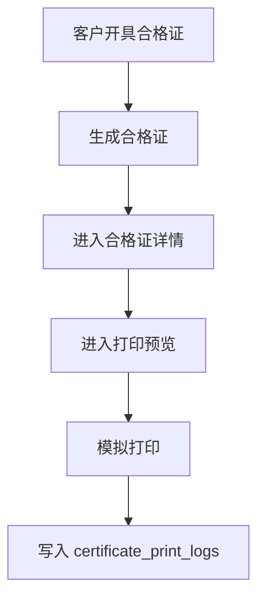
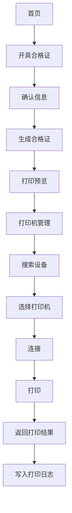

# 第24步_K329打印机接入设计方案

## 一、现有打印流程审计

当前流程：



当前已有：

- `packages/print-core` 打印抽象包；
- 小程序打印预览页；
- 小程序打印机连接页；
- 后端 `certificate_print_logs`；
- 合格证详情打印记录；
- 模拟打印。

当前缺少：

- 统一的 `scanDevices/connect/disconnect/getStatus/printLabel/getBattery/getPaperStatus` 适配器接口；
- K329 蓝牙适配器结构；
- 打印机管理页面；
- 打印状态友好映射；
- 打印机名称、型号、连接方式、操作人等日志字段；
- 后台打印设备管理；
- 后台打印测试入口；
- K329 指令选择方案和测试流程。

## 二、K329资料审计结果

已审计资料：

- `K329.pdf`
- `K329使用手册0428.pdf`
- `便携机K329-SDK（2412).zip`

确认能力：

- 蓝牙 2.1+4.2；
- USB Type-C；
- WiFi 可选；
- 203 DPI；
- 最大有效打印宽度 72mm；
- 支持 42-80mm 纸宽；
- 支持标签纸、连续纸、黑标纸；
- 支持 ESC/POS、CPCL、TSPL；
- 支持二维码；
- 支持 GB18030 中文字库；
- 支持缺纸、开盖、低电量、过热、间隙错误、黑标错误等状态。

SDK 包内已发现：

- Android SDK/Demo；
- UNI-APP SDK；
- `UNI_APP 蓝牙打印机接口说明(JS 方式).txt`；
- `UNI_APP 蓝牙打印机接口说明(SDK自定义基座方式).txt`；
- `bluetooth-print.vue`；
- `bluetooth-sdk-print.vue`；
- `components/gprint/tsc.js`；
- `components/gprint/esc.js`。

判断：

- 微信小程序优先走 UNI-APP JS 蓝牙方式；
- 自定义基座方式更偏 App/自定义运行基座，不作为微信小程序第一选择；
- 标签打印优先 TSPL。

## 三、目标打印流程



原则：

- 生成合格证后不直接调用打印；
- 页面不直接调用蓝牙；
- 打印统一经过 `print-core`；
- 支持未来多品牌、多连接方式、多标签模板。

## 四、print-core 架构

已完善：

- `PrinterAdapter` 统一接口；
- `MockPrinterAdapter`；
- `K329BluetoothAdapter` 真实蓝牙预留；
- `UsbPrinterAdapter` 预留；
- `WifiPrinterAdapter` 预留；
- `CertificatePrintPayload`；
- `CertificateLabelTemplate`；
- K329 能力描述；
- 打印状态中文提示映射。

统一接口：

```ts
interface PrinterAdapter {
  scanDevices(): Promise<PrinterDeviceInfo[]>;
  connect(device?: PrinterDeviceInfo): Promise<PrinterDeviceInfo>;
  disconnect(): Promise<void>;
  getStatus(): Promise<PrinterStatus>;
  printLabel(job: PrintJob): Promise<PrintResult>;
  getBattery(): Promise<number | null>;
  getPaperStatus(): Promise<PrinterPaperStatus>;
}
```

当前真实蓝牙适配器不做假实现，调用时会明确提示待接入。

## 五、小程序完善

已调整：

- 打印机连接页升级为“打印机管理”；
- 支持搜索设备；
- 支持选择设备；
- 支持连接/断开；
- 支持测试打印；
- 支持状态展示；
- 打印预览页走 `print-core`；
- 打印后写入增强后的打印日志。

当前仍是模拟打印，不调用真实蓝牙。

## 六、后台完善

已新增：

- 打印设备管理菜单；
- 打印设备列表；
- 新增打印机；
- 打印设备导出；
- 打印测试项目展示。

后台打印测试只展示测试项目，不调用真实硬件。

## 七、数据库变化

新增 migration：

`20260713093000_printer_architecture`

新增：

- `printers` 表。

补充 `certificate_print_logs` 字段：

- `printer_id`
- `printer_name`
- `printer_model`
- `connection_type`
- `operator_name`

未删除旧数据，历史打印记录可继续展示。

## 八、暂不做内容

本阶段不做：

- 不调用真实蓝牙；
- 不接优博讯原生插件；
- 不申请蓝牙权限；
- 不写死 UUID；
- 不写死蓝牙 Characteristic；
- 不发布小程序；
- 不上传体验版；
- 不部署线上。

## 九、下一步

拿到样机后按《K329打印测试流程.md》测试：

1. 确认小程序 JS 蓝牙方式能扫描到 K329；
2. 确认 write 特征；
3. 用 TSPL 打印文字；
4. 打印二维码；
5. 打印 60×80 标签；
6. 查询缺纸、开盖、低电量；
7. 调整纸张类型、间隙、浓度、偏移。

## 十、本地构建结果

本次已执行：

- `@guxin/print-core build`：通过；
- `backend build`：通过；
- `admin-web build`：通过；
- `public-h5 build`：通过；
- `miniapp build:mp-weixin`：通过；
- `pnpm smoke:https`：通过，13/13。

## 十一、部署结果

本次未部署正式测试环境。

原因：

- 当前阶段目标是建立 K329 打印接入架构；
- 未实现真实蓝牙通信；
- 未调用真实打印机；
- 需要等厂家确认微信小程序蓝牙通信细节和样机测试后再部署真实打印能力。

