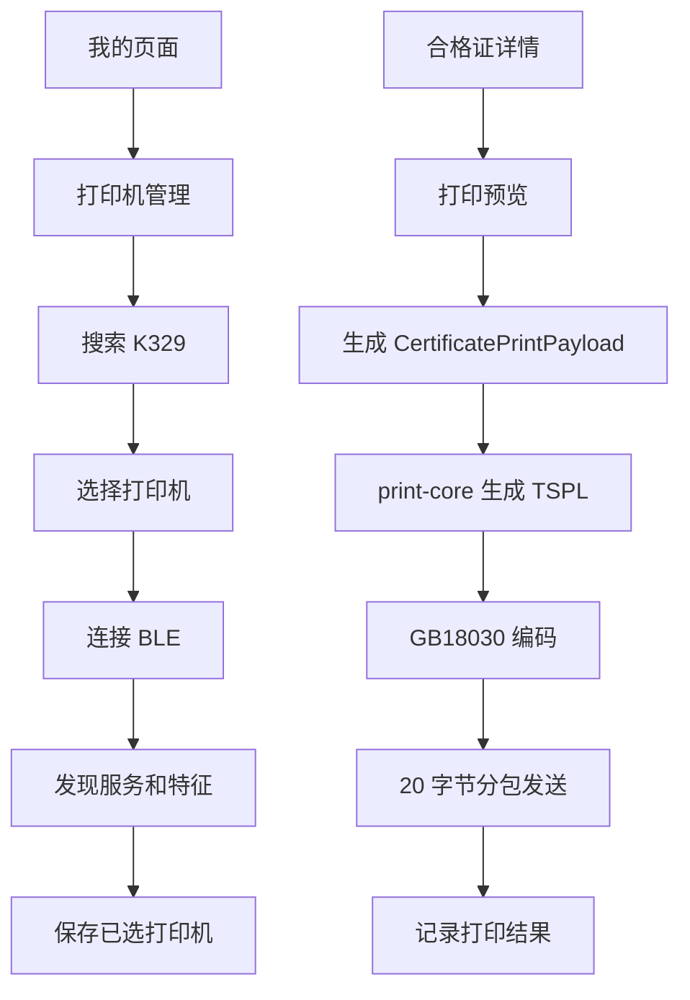

# 第25步 K329官方微信小程序SDK真实打印第一阶段记录

## 一、本次目标

本次在不发布微信小程序、不接入 WiFi/USB、不做多品牌复杂扩展的前提下，把原来的模拟打印流程升级为“优博讯 K329 蓝牙真实打印第一阶段”。

本阶段重点是：

1. 分析厂家微信小程序 SDK；
2. 保持现有 `packages/print-core` 抽象层；
3. 实现 `K329BluetoothAdapter`；
4. 小程序打印机管理页接入真实搜索、连接、断开、测试打印；
5. 打印预览页通过 `print-core` 发送 TSPL 标签；
6. 保留 Mock 打印能力，避免影响已有演示流程。

## 二、厂家 SDK 分析结果

### 1. 蓝牙连接流程

厂家微信小程序 SDK 的连接流程为：

1. 打开蓝牙适配器；
2. 检查蓝牙是否可用；
3. 开始搜索蓝牙设备；
4. 获取设备列表；
5. 用户选择设备；
6. 建立 BLE 连接；
7. 获取设备服务；
8. 遍历服务下的特征值；
9. 找到可写、可读、可通知特征；
10. 使用可写特征发送打印数据。

### 2. 设备搜索流程

SDK 使用 `startBluetoothDevicesDiscovery` 搜索设备，再调用 `getBluetoothDevices` 获取结果。示例中搜索约 5 秒后停止扫描。

本系统实现中保留该策略：

1. 默认搜索 5 秒；
2. 过滤无名称设备；
3. 不把蓝牙 UUID、技术参数展示给客户；
4. 页面只显示设备名称、信号、连接状态。

### 3. 服务发现流程

SDK 没有强制写死 UUID，而是遍历服务和特征，寻找：

1. `write` 特征；
2. `notify` 或 `indicate` 特征；
3. `read` 特征。

本系统沿用该策略，优先保证同系列设备兼容性，避免把某个样机 UUID 写死到业务代码里。

### 4. 数据发送流程

厂家 SDK 通过 `writeBLECharacteristicValue` 发送打印数据。

本系统封装为：

`K329BluetoothAdapter.write(bytes)`

页面不直接调用蓝牙 API。

### 5. 分包方式

厂家示例按 20 字节分包发送。

本系统默认：

1. 单包 20 字节；
2. 包间隔 20ms；
3. 所有分包逻辑在 `K329BluetoothAdapter` 内部完成；
4. 页面和业务代码不关心分包细节。

### 6. TSPL 生成方式

厂家 SDK 的标签示例使用 TSPL：

1. `SIZE`
2. `GAP`
3. `CLS`
4. `TEXT`
5. `QRCODE`
6. `PRINT`

本系统没有直接复制厂家 Demo 页面，而是在 `print-core` 中统一生成谷芯合格证标签 TSPL。

## 三、本次实现内容

### 1. print-core

已实现：

1. `K329BluetoothAdapter`
2. `K329BluetoothBridge`
3. `buildK329TsplCommand`
4. `encodeTsplCommand`
5. 20 字节分包发送
6. TSPL 60×80mm 标签模板
7. K329 状态文案

保留：

1. `MockPrinterAdapter`
2. USB / WiFi 适配器预留

### 2. 小程序

新增：

1. `miniapp/src/print/k329Bridge.ts`
2. `miniapp/src/print/k329Encoding.ts`
3. `miniapp/src/print/vendor/k329/encoding.js`
4. `miniapp/src/print/vendor/k329/encoding-indexes.js`

优化：

1. 打印机管理页；
2. 打印预览页；
3. 测试打印；
4. 打印状态提示；
5. 打印失败提示。

### 3. 中文打印处理

厂家 TSPL 工具使用 `gb18030` 编码。  
本系统按厂家 SDK 方式引入 GB18030 编码工具，打印中文时不使用 UTF-8 猜测。

## 四、当前打印流程

## 五、测试打印

小程序打印机管理页支持：

1. 文字测试；
2. 二维码测试；
3. 完整标签测试。

测试记录保存在小程序本地，仅用于现场排查，不含密钥。

## 六、本阶段未做

1. 未发布微信小程序；
2. 未上传体验版；
3. 未接入 WiFi 打印；
4. 未接入 USB 打印；
5. 未做复杂自动重连；
6. 未做检测仪上传；
7. 未写死蓝牙 UUID；
8. 未写入 AppSecret 或任何密钥。

## 七、剩余问题

1. 需要真机验证 K329 的设备名称、服务发现结果和写入特征；
2. 需要真机验证 TSPL 中文字体效果；
3. 需要真机验证二维码尺寸和标签位置；
4. 需要真机验证缺纸、开盖、低电量状态回传；
5. 如果某些手机要求蓝牙权限提示，需要在小程序体验测试时补充引导。

## 八、下一步建议

1. 用微信开发者工具打开小程序；
2. 在真实手机上预览或体验；
3. 打开 K329，进入“我的 - 打印机管理”；
4. 搜索并连接 K329；
5. 先测试“文字”，再测试“二维码”，最后测试“完整标签”；
6. 根据实际打印位置微调 TSPL 坐标；
7. 根据 K329 状态回传结果补齐缺纸、开盖、低电量识别。
